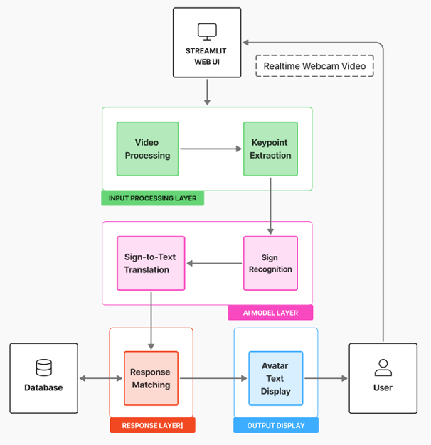

# 대중교통 이용 상황에서의 청각장애 농인을 위한 수어 통역 시스템
청각 장애인이 수어로 목적지를 입력하면 실시간으로 인식하여 시각적 길안내를 제공하는 웹 기반 키오스크 시스템 입니다.

## 주요 기능
1. 비디오 파일 분석
2. 키포인트 파일 분석
3. 실시간 웹캠 인식
4. 지하철 키오스크 모드

## 기술 스택
- Frontend : Streamlit
- Backend : Python(Pytorch + OpenCV + MediaPipe)

## 서비스 아키텍처


## 프로젝트 구조
```
핵심 구조:
├── app.py                    # Streamlit 메인 앱
├── page/                     # 6단계 키오스크 플로우
├── utils/                    # TCN 모델 + 실시간 인식 엔진
├── models/                   # 10.2MB 사전 학습 모델 (995 클래스)
├── gif_images/               # 6개 안내 애니메이션
├── 데이터 구축 및 학습 코드/   # 데이터 전처리 및 ver별 모델 code
└── 샘플 데이터/               # 테스트용 비디오/키포인트 파일
```

디렉토리명을 pages -> page로 변경 (pages로 할 경우 streamlit 예약 명령어로 사이드바 생성됨)

<br>
<br>
<br>

# 수어 통역 시스템 실행 가이드

## 가상환경 생성
```bash
# MediaPipe 호환성 (Python 3.8 ~ 3.11 ver 지원)
conda create -n sign python=3.11 -y
```
## 가상환경 활성화
```bash
conda activate sign
```
## 프로젝트 디렉토리로 이동
```bash
cd Sign-Language-Recognition
```
## 필요한 패키지 설치
```bash
pip install -r requirements.txt
```
## stremalit 웹 애플리케이션 실행
```bash
streamlit run app.py
```